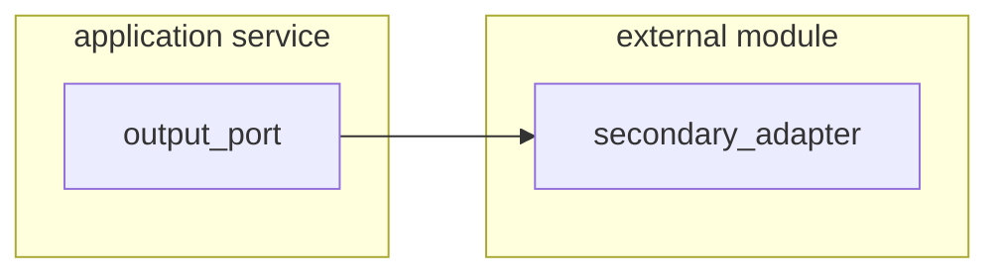

# External Module

## Calling External System

> gRpc, Rest, GraphQL, IA strategy, ...etc.

First, You must create or have an output port in the application service layer.
So, You create an adapter for implement these ports.

