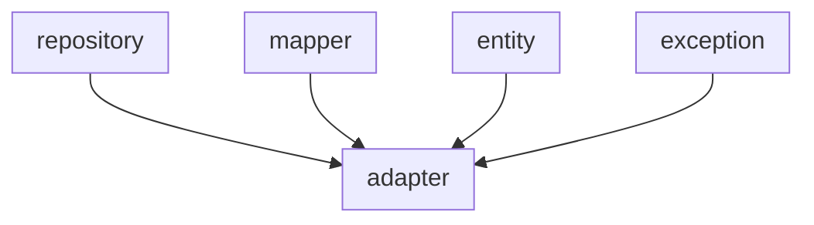

# Data Access Module

Part I.

- Secondary Adapter to DB
- Mapper
- Explicit Repositories to DB

## Recommendations

### Follow these steps

1. Create an entity class.
2. [Optional] Create an exception class.
3. Create a mapper class:
    1. Method From Entity to Domain Model.
    2. Method From Domain Model to Entity.
4. Create a Jpa Repository.
5. Create an adapter for jpa repository (Secondary Adapter).
    1. [Optional] Implement Domain OutPort(Repository).

