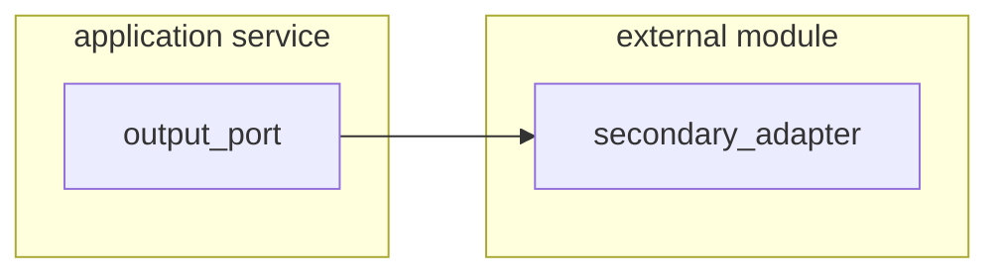

# External Module

## Calling External System
>  _Rest, Soap, gRpc, GraphQL, IA strategy, etc._


First, You must create or have an output port in the application service layer. So, You create an adapter for implement
these ports.



Part I.

- DTO to client specific.
- Mappers

Part II.

- Implementing output ports(Publishers/Producers)
    - Secondary Adapter

### Dependencies
```xml title="pom.xml" linenums="1" hl_lines="4"
<dependencies>
    <dependency>
        <groupId>com.lg5.spring</groupId>
        <artifactId>lg5-spring-client</artifactId>
    </dependency>
    ...
</dependencies>
```
