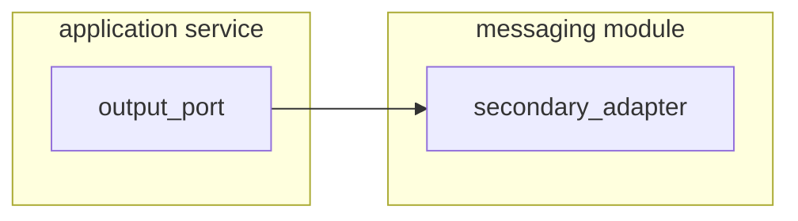

# Message Module

## Publisher

First, You must create or have an output port in the application service layer. So, You create an adapter for implement
these ports.

[Example a spec with AsyncAPI][2]


Part I.

- Models from Event Specification(e.g: Avro Models)
- Mappers

Part II.

- Implementing output ports(Publishers/Producers)
    - Secondary Adapter
- Implementing input ports(Listener/Consumers)
    - Primary Adapter

## Dependencies
=== "Message Model"

    > **Important** add the avro plugin and generate the avro models with `mvn -pl blank-message/blank-message-model clean install`

    ```xml
    <dependency>
        <groupId>com.lg5.spring.kafka</groupId>
        <artifactId>lg5-spring-kafka-model</artifactId>
    </dependency>
    ```
=== "Message Core"

    ```xml
    <!-- Implements OUTPUT ports from application service layer -->
    <dependencies>
      <dependency>
        <groupId>com.blanksystem</groupId>
        <artifactId>blank-application-service</artifactId>
      </dependency>
      <dependency>
        <groupId>com.blanksystem</groupId>
        <artifactId>blank-message-model</artifactId>
      </dependency>
      <!-- if you need to produce events-->
      <dependency>
        <groupId>com.lg5.spring.kafka</groupId>
        <artifactId>lg5-spring-kafka-producer</artifactId>
      </dependency>
      <!-- if you need to consume events-->
      <dependency>
        <groupId>com.lg5.spring.kafka</groupId>
        <artifactId>lg5-spring-kafka-consumer</artifactId>
      </dependency>
    </dependencies>
    ```
## Plugins to generate avro models
Only for **blank-message-model** submodule.     
* First, Add `avro-maven-plugin` for mng the avro model to java objects.
* Second, Disable the `maven-checkstyle-plugin`with `<skip>true</skip>`.
```xml 
<build>
    <plugins>
        <plugin>
            <groupId>org.apache.maven.plugins</groupId>
            <artifactId>maven-checkstyle-plugin</artifactId>
            <configuration>
                <skip>true</skip>
            </configuration>
        </plugin>
        <plugin>
            <groupId>org.apache.avro</groupId>
            <artifactId>avro-maven-plugin</artifactId>
        </plugin>
    </plugins>
</build>
```

## Project structure
=== "Message model structure"
    > **Important** add the avro plugin and generate the avro models with `mvn -pl blank-message/blank-message-model clean install`

    ```markdown hl_lines="10 12"
     src/
     ├── main/
     │  ├── java/
     │  │  └── com.blanksystem.message/
     │  │       └── model/
     │  │          └── avro/
     │  │             └── BlankAvroModel.java(autogenerate)
     │  └── resources/
     │     ├── avro/
     │     │  └── blank.avsc
     │     └── spec/
     │        └── asyncapi.yaml
    ```
    Also, you must add the Async Api definition into `resourses/spec/asyncapi.yaml`


=== "Message core structure"
    ```markdown
    main/
    └── java/
        └── com.blanksystem.blank.service.message
            ├── listener/
            │  └── kafka/
            │     └── BlankKafkaListener.java
            ├── mapper/
            │  └── BlankMessagingDataMapper.java
            └── publisher/
               └── kafka/
                   └── BlankEventKafkaPublisher.java
    ```
_Read more about [openapi guidelines][1]_

# 2'DO

- [ ] Support for asyncapi definition and a process to avro files automatically generation.

[1]: https://lufgarciaqu.medium.com
[2]: https://blank-service-atdd.web.app/asyncapi/