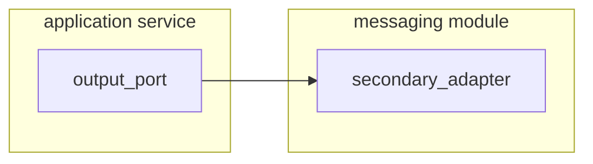

# Message Module

## Publisher

First, You must create or have an output port in the application service layer. So, You create an adapter for implement
these port.

Part I.

- Models from Event Specification(e.g: Avro Models)
- Mappers

Part II.

- Implementing output ports(Publishers/Producers)
    - Secondary Adapter
- Implementing input ports(Listener/Consumers)
    - Primary Adapter   