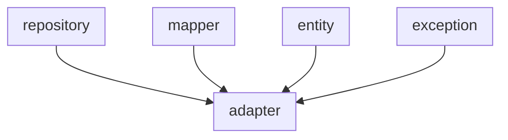

# Data Access Module

Part I.

- Secondary Adapter to DB
- Mapper
- Explicit Repositories to DB



## Recommendations

### Follow these steps

1. Create an entity class.
2. [Optional] Create an exception class.
3. Create a mapper class:
    1. Method From Entity to Domain Model.
    2. Method From Domain Model to Entity.
4. Create a Jpa Repository.
5. Create an adapter for jpa repository (Secondary Adapter).
    1. [Optional] Implement Domain OutPort(Repository).

## Dependencies
```xml linenums="1" hl_lines="9"
<dependencies>
   <dependency>
      <groupId>com.blanksystem</groupId>
      <artifactId>blank-application-service</artifactId>
   </dependency>
   <!--lg5 dependencies-->
   <dependency>
      <groupId>com.lg5.spring</groupId>
      <artifactId>lg5-spring-data-jpa</artifactId>
   </dependency>
   <!-- if you need SAGA Pattern/Outbox Pattern, else remove dependencies -->
   <dependency>
      <groupId>com.lg5.spring.outbox</groupId>
      <artifactId>lg5-spring-outbox</artifactId>
   </dependency>
</dependencies>
```

## 💾 Migrations with liquibase
> **Recommendation:** Use the following keywords to filename, for instance:      
> **DDL:** For schema or structural changes such as creating tables, modifying columns, adding indexes, or constraints.    
> **DML:** For data operations such as inserting, updating, or deleting records.    
> **DATA:** For large data imports, migrations, or initial data loads.  
> **Patch:** For small fixes or patches applied to correct data or structure issues.
> **View:** For database view creation or modifications.  
> **Proc:** For creating or altering stored procedures or functions in the database.

Example:
```
ddl-v.0.0.1.yaml
dml-v.0.0.2.yaml
ddl-v.0.0.3.yaml
```

## Project Structure

```markdown
src
 ├── java/
 │  └── com.blanksystem.blank.service.data
 │      ├── adapter/
 │      │  └── *.java
 │      ├── entity/
 │      │  └── *.java
 │      ├── exception/
 │      │  └── *.java
 │      ├── mapper/
 │      │  └── *.java
 │      └── repository/
 │         └── *JPARepository.java
 └── resources/
    └── db/
       └── changelog/
          ├── db.changelog-master.yaml
          └── ddl-v.0.0.1.yaml
```

## 2'DO
- [ ] Support other databases


